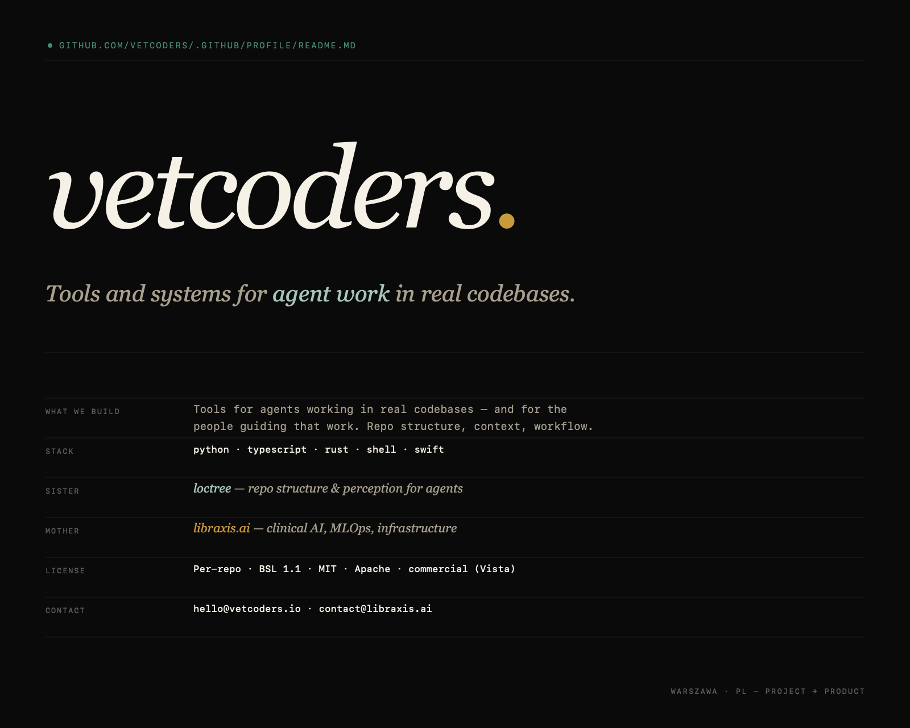

  

---

Founded by veterinarians. We build the tools and systems we needed for working with agents in real repos — not from a masterplan, but because something hurt, something broke, or something was missing from the daily flow. The ones that stayed are the ones that helped move work from project toward product.

## Start here

This is the **vetcoders** org. You can start anywhere below — or pick a pinned repo above.

## What we build

Tools for agents working in real codebases — and for the people guiding that work. Repo structure, context, workflow. Things that help work stay understandable as it moves from project toward product.

Vibecrafted is one part of that system.

## Family

- **mother** — [LibraxisAI](https://github.com/LibraxisAI) · clinical AI, MLOps, infrastructure
- **sister** — [Loctree](https://github.com/Loctree) · repo structure & perception for agents

## Contact

- **General** — [hello@vetcoders.io](mailto:hello@vetcoders.io)
- **Group / mother org** — [contact@libraxis.ai](mailto:contact@libraxis.ai)
- **Security** — see [SECURITY.md](https://github.com/vetcoders/.github/blob/main/SECURITY.md)

## License

Per-repo. Most flagship tools use **BSL 1.1** (Business Source License). Some helpers are MIT or Apache 2.0. Vista is commercial. Check each repo's `LICENSE` file before using.

---

  Warszawa, PL · Project → Product · © 2024–2026 LibraxisAI

